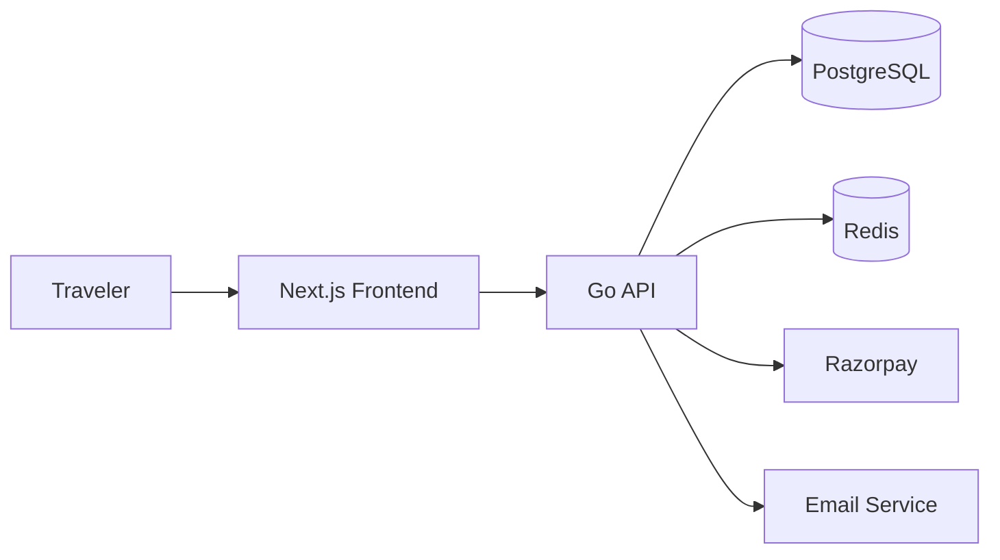

# Airbus - Airline Booking Platform
=======
# Airbus Airline Booking Platform

Airbus is a full-stack airline booking application built to simplify the travel booking journey for users. It helps travelers search for flights, view available seats, reserve a trip, provide passenger details, complete secure payment, and manage their reservations from a single digital experience.

This project solves the common pain points of flight booking by combining flight discovery, seat selection, passenger management, payment handling, trip tracking, and travel document generation in one platform.

## Problem it solves

Traditional flight booking experiences are often fragmented across multiple steps and systems. Users may need to:

- search for flights across routes and dates
- compare options manually
- reserve seats without a clear flow
- fill in passenger data in a disconnected process
- pay through separate gateway integrations
- track cancellations, refunds, and trip records later

Airbus brings these tasks into a streamlined, end-to-end booking flow so customers can complete bookings quickly and confidently.

## What the platform includes

- Flight search and discovery
- Dynamic airport and route selection
- Seat map selection for a chosen flight
- Passenger information collection
- Reservation hold and expiry flow
- Secure payment integration with Razorpay
- Booking confirmations and ticket generation
- Trip management for upcoming and past journeys
- Refund and cancellation handling
- Saved passenger profiles
- Boarding pass and ticket download experience

## Tech stack

### Frontend
- Next.js 16
- React 19
- TypeScript
- Tailwind CSS
- TanStack Query
- Shadcn/ui components

### Backend
- Go
- HTTP routing and middleware patterns
- PostgreSQL database
- Redis for rate limiting and reservation lifecycle management
- JWT authentication
- Email notification integration
- Payment gateway integration

### Infrastructure
- Docker
- Docker Compose
- Redis container for local caching and rate limiting

## Architecture overview



## Project structure

```text
airbus/
├── Backend/                 # Go backend source
├── frontend/web/            # Next.js frontend application
├── static/                 # Static assets and demo/test content
├── docker-compose.yaml      # Local container orchestration
├── README.md                # Project overview
├── .gitignore               # Repository ignore rules
└── ...
```

## Typical user journey

1. A traveler arrives on the home page and searches for available flights.
2. The user selects a flight and chooses a seat from the seat map.
3. Passenger details are captured and saved if needed.
4. The reservation is created and held temporarily.
5. Payment is processed securely.
6. A ticket is generated and the traveler can view or download the boarding pass.
7. The user can revisit My Trips to manage bookings and refunds.

## Core user value

Airbus is designed for modern air travel booking experiences with a clean UI and a simpler booking flow. It gives users a practical way to:

- move from search to payment without friction
- manage booking information in one place
- understand trip status and ticket details
- complete travel transactions with fewer manual steps

## Local setup

This project expects a local environment with Docker and the required env files in place.

### 1. Clone the repository

```bash
git clone https://github.com/aditya242007/bus.git
cd airbus
```

### 2. Configure environment files

The app expects configuration files such as:

- `backend/.env`
- `frontend/web/.env.local`

These are used by the Go API and Next.js frontend for database, auth, Redis, and payment configuration.

### 3. Start the stack

```bash
docker compose up --build
```

Then open the frontend in a browser at:

```text
http://localhost:3000
```

The backend API should be exposed on:

```text
http://localhost:8088
```

## Notes

- The frontend and backend are intentionally separated to keep the booking experience responsive while allowing business logic to live in a dedicated API layer.
- Redis is used to support reservation expiry and rate limiting behavior.
- Payment flow is designed around Razorpay integration for secure transaction handling.

## Contributors

This project is built as a full-stack booking platform for airline-style travel experiences and can be extended with features such as admin dashboards, fare management, inventory controls, and analytics.
